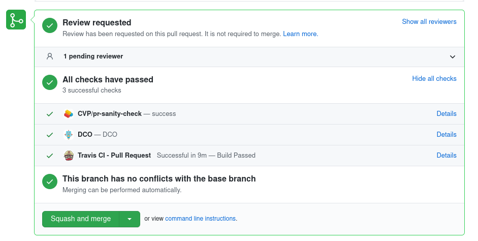
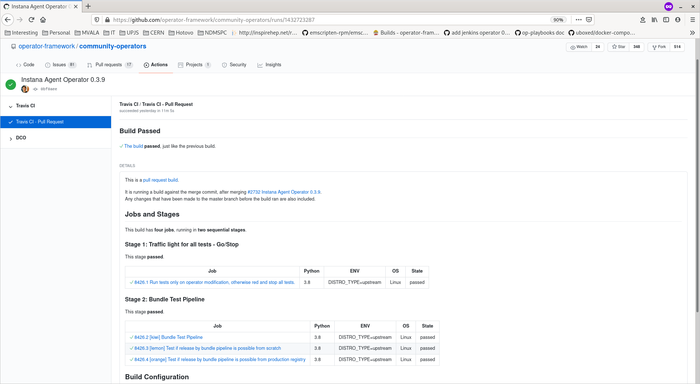
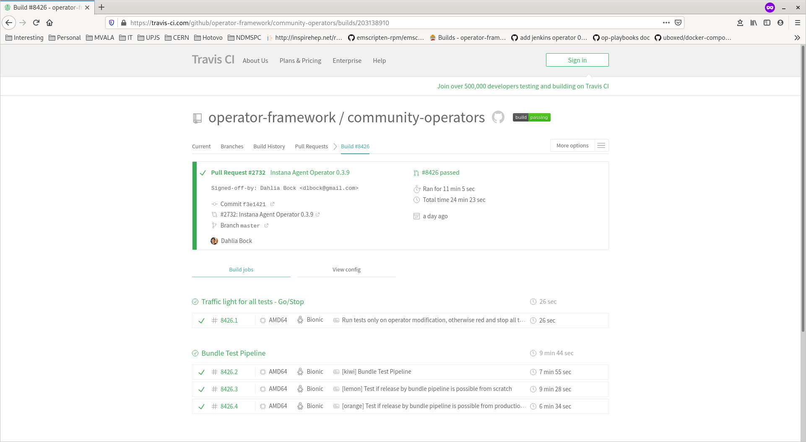

# Submiting your Operator vi Pull Requests (PR)

## Fork community opertators project
To submit operator one have to do two steps

1. fork project `https://github.com/operator-framework/community-operators`
1. make pull request
1. place operator to target directory
  - community-operators (opensift operator)
  - upstream-community-operators (kubernetes operator)

## Pull request
When pull request is created, number of tests are executed. One can see results in `Travis CI - Pull Request `.

## Test results via Travis jobs
There are multiple tests. For easy mapping different fruit names were chosen.
One can see more details about tests when clicking on `Details`. This will redirect to following page

and via travis ui

### Kiwi test
Full operator tests

- Building bundle image
    - from packagemanifest format
    - from bundle format
- Sanity check of operator version (when multiple only last test is done)
- Validation of using `operator-sdk validate`
- Building temporary catalog with one operator version in it
- Deployment of opeator on kind (k8s) cluster (only for kuberbetes-operator)

### Lemon test
Test if operator can be added to index from scratch

- Build all bundle images
- Build catalog

### Oragne test
Test if operator can be added to index from existing bundles from production (quay.io)

- Build current opeator version locally
- Use older versions from from quay.io
- Build catalog

!!! note
    It might happen that operator version is already published and in this case one have to set (ask mantainers) to set label `allow/operator-version-overwrite`

#### Operator version overwrite
When cosmetic changes are made to already published operator version `Orange` test will fail. In this case one needs to have `allow/opeator-version-overwrite` label set. One can set it or ask maintainer to set it for you.

After PR will be merged following changes will happen

- Bundle for current operator version will be overwritten
- Build catalog with new bundle

#### Operator recreate
When whole operator is recreated (usually when converting whole operator from packagemanifest format to bundle format). One needs to have `allow/opeator-recreate` label set. One can set it or ask maintainer to set it for you.

After PR will be merged following changes will happen

- Delete operator
- Rebuild all bundles
- Build catalog with new bundles

## Test on openshift cluster
For openshift operator the test is executed on openshift cluster via `ci/prow/deploy-operator-on-openshift`.

!!! note
    The `kiwi` test doesn't include to do same test on k8s cluster in Travis job. This can be forced by specifiyng label `test/force-deploy-on-kubernetes` in PR.

# More information
More detailed information about our Continues integration process can be found [here](./ci.md)