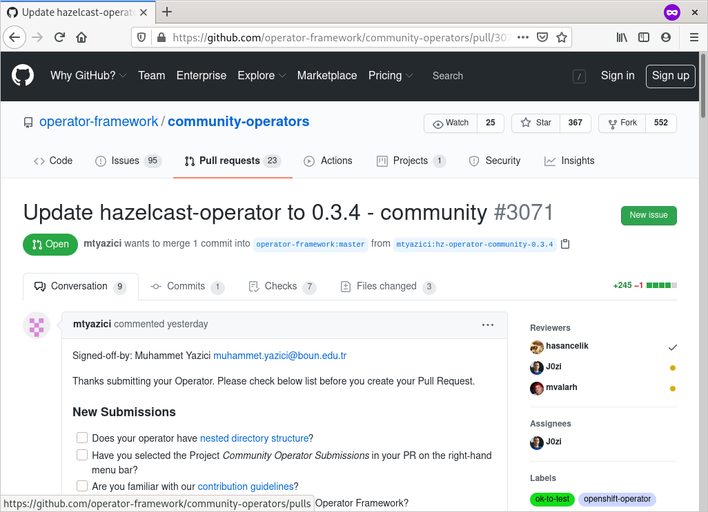
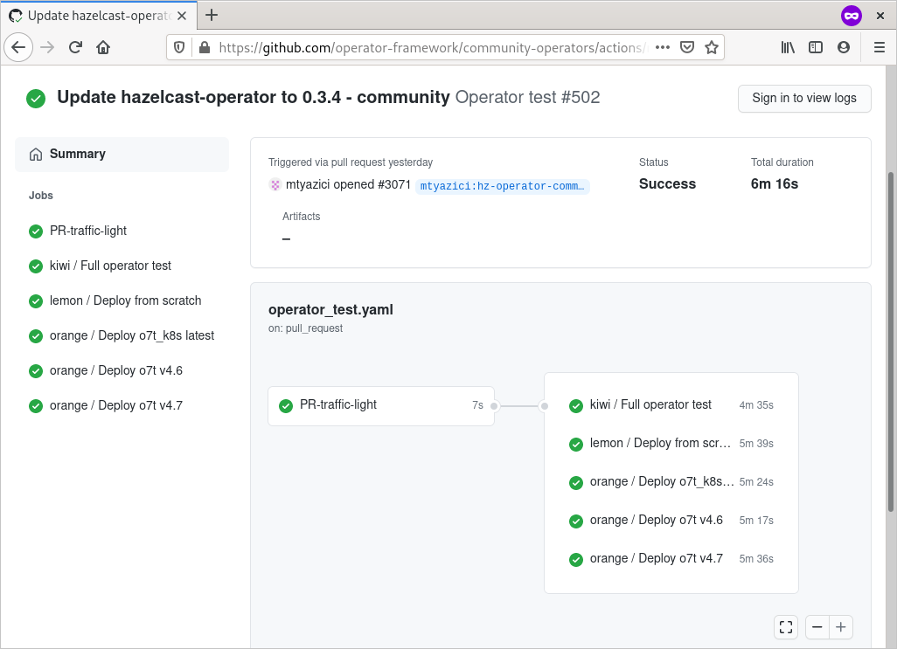
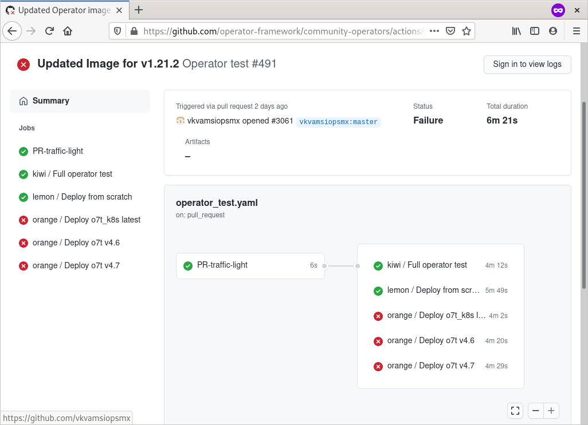

# Submitting your Operator via Pull Requests (PR) in community operators project

## Overview
To submit an operator one has to do these steps

1. Test your operator locally
1. Fork project `https://github.com/operator-framework/community-operators`
1. Make a pull request
1. Place the operator in the target directory. [More info](./contributing-where-to.md)
    - community-operators (Openshift operator)
    - upstream-community-operators (Kubernetes operator)
1. Conigure `ci.yaml` file. [More info](./operator-ci-yaml.md)
    - Setup reviewers
    - Operator versioning strategy
1. Verify tests and fix problems, if possible
1. Ask for help in the PR in case of problems

## Test locally before you contribute

The team behind OperatorHub.io will support you in making sure your Operator works and is packaged correctly. You can accelerate your submission greatly by testing your Operator with the Operator Framework by following our [documentation for local manual testing](./testing-operators.md) or automated testing [using scripts](./operator-test-suite.md). You are responsible for testing your Operator's APIs when deployed with OLM.

## Pull request
When a pull request is created, a number of tests are executed. One can see the results in `Checks` tab.

## Verify CI test results

Every PR against this repository is tested via [Continuous Integration](./tests-in-pr.md). During these tests your Operator will be deployed on either a `minikube` or OpenShift 4 environments and checked for a healthy deployment. Also several tools are run to check your bundle for completeness. These are the same tools as referenced in our [testing docs](./testing-operators.md) and [testing scripts](./operator-test-suite.md). Pay attention to the result of GitHub checks.

More detailed information about our Continuous Integration process can be found [here](./tests-in-pr.md)

## Test results

Test results are located in `Checks` tab. Then they can be found in `Operator test` list on left side. Once clicked on it the summary of test will be shown. 

There are multiple tests. For easy mapping different fruit names were chosen. Look at our [testing suite](./tests-in-pr.md) for more information.
One can see more details about tests when clicking on directly on them. 

## Test on an Openshift cluster
For an Openshift operator (operators in `community-operators` directory), the deployment of operator is executed on an Openshift cluster via `ci/prow/deploy-operator-on-openshift`.

!!! note
    The `kiwi` test does not include the deployment test on k8s cluster . This can be forced by specifying label `test/force-deploy-on-kubernetes` in the PR.

## You are done
User is done when all tests are green. When the PR is merged, on can follow process explained in [Release pipeline](./operator-release-process.md).
## Test results failed?
When operator tests are failing, one can see following picture

In case of failures, please have a look at logs of specific tests. If error is not clear to you, please ask in the PR. Maintainers will be happy to help you with it.
