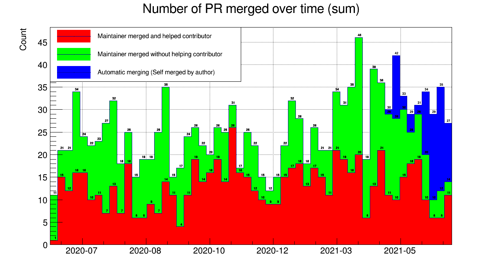
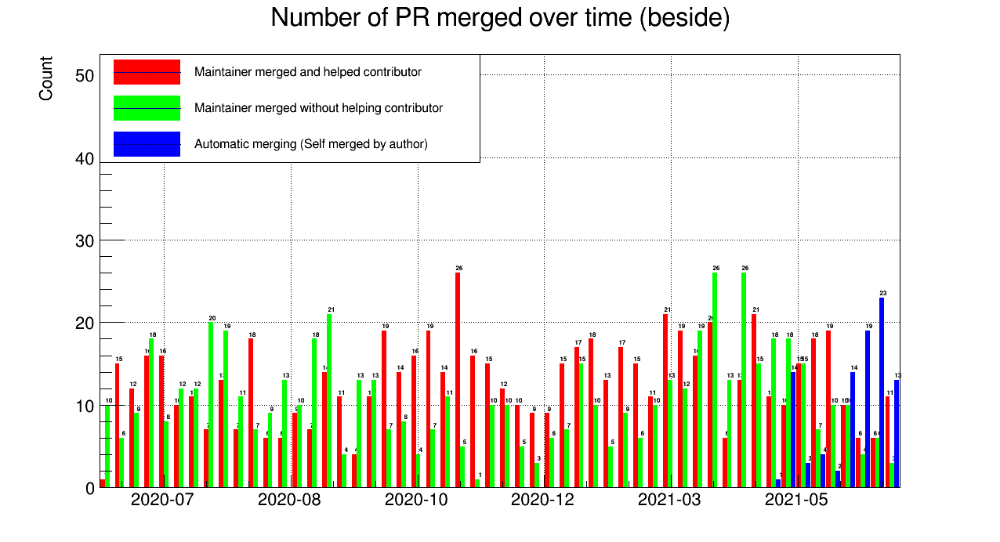
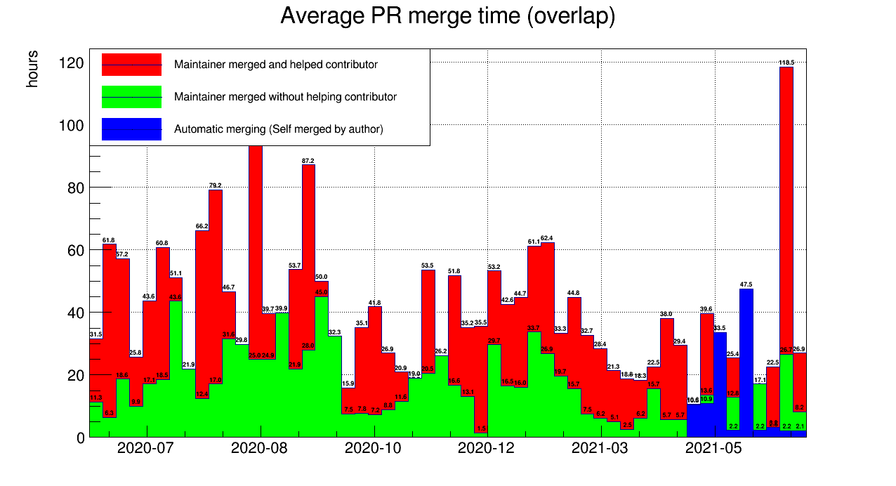

# Community operators statistics
## History
### Number of PR over time

Download : [png](images/stats/nPrOverTime_stack.png) [pdf](images/stats/nPrOverTime_stack.pdf)

Download : [png](images/stats/nPrOverTime_nostackb.png) [pdf](images/stats/nPrOverTime_nostackb.pdf)

## Average PR merging time

Download : [png](images/stats/avgTimePrOverTime_nostackb.png) [pdf](images/stats/avgTimePrOverTime_nostackb.pdf)

Download : [png](images/stats/avgTimePrOverTime_nostack.png) [pdf](images/stats/avgTimePrOverTime_nostack.pdf)
