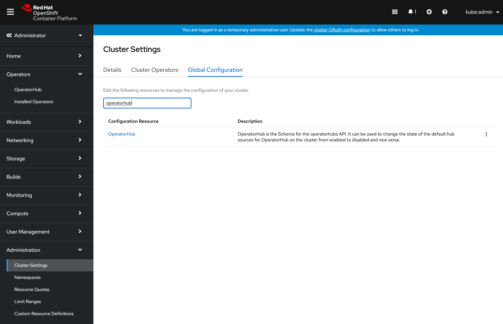

# Testing your Operator with Operator Framework
<!-- START doctoc generated TOC please keep comment here to allow auto update -->
<!-- DON'T EDIT THIS SECTION, INSTEAD RE-RUN doctoc TO UPDATE -->
<!-- **Table of Contents**  *generated with [DocToc](https://github.com/thlorenz/doctoc)*-->

<!-- - [Overview](#overview)
- [Accepted Contribution formats](#accepted-contribution-formats)
  - [*packagemanifest* format (mandatory for all OLM versions prior to 0.14.0 and earlier, supported on all available versions)](#packagemanifest-format-mandatory-for-all-olm-versions-prior-to-0140-and-earlier-supported-on-all-available-versions)
  - [*bundle* format (supported with 0.14.0 or newer)](#bundle-format-supported-with-0140-or-newer)
- [Pre-Requisites](#pre-requisites)
  - [Kubernetes cluster](#kubernetes-cluster)
  - [Container Tooling](#container-tooling)
  - [Operator Framework components](#operator-framework-components)
  - [Preparing file structure](#preparing-file-structure)
- [Operator Metadata Validation](#operator-metadata-validation)
  - [Temporary conversion of packagemanifest to bundle](#temporary-conversion-of-packagemanifest-to-bundle)
  - [Using operator-sdk to validate your Operator](#using-operator-sdk-to-validate-your-operator)
- [Publishing your Operator metadata to a catalog for testing](#publishing-your-operator-metadata-to-a-catalog-for-testing)
  - [Building a catalog using `packagemanifest` format](#building-a-catalog-using-packagemanifest-format)
  - [Building a catalog using bundles](#building-a-catalog-using-bundles)
- [Testing Operator Deployment on Kubernetes](#testing-operator-deployment-on-kubernetes)
  - [Installing Operator Lifecycle Manager](#1-installing-operator-lifecycle-manager)
  - [Adding the catalog containing your Operator](#2-adding-the-catalog-containing-your-operator)
  - [View Available Operators](#3-view-available-operators)
  - [Create an OperatorGroup](#4-create-an-operatorgroup)
  - [Create a Subscription](#5-create-a-subscription)
  - [Verify Operator health](#6-verify-operator-health)
- [Testing Operator Deployment on OpenShift](#testing-operator-deployment-on-openshift)
  - [1. Create the CatalogSource](#1-create-the-catalogsource)
  - [2. Find your Operator in the OperatorHub UI](#2-find-your-operator-in-the-operatorhub-ui)
  - [3. Install your Operator from OperatorHub](#3-install-your-operator-from-operatorhub)
  - [4. Verify Operator health](#4-verify-operator-health)
- [Testing with scorecard](#testing-with-scorecard)
- [Additional Resources](#additional-resources) -->

<!-- END doctoc generated TOC please keep comment here to allow auto update -->
## Overview
These instructions walk you through how to manually test that your Operator deploys correctly with Operator Framework, when packaged for the Operator Lifecycle Manager. Although your submission will always be tested as part of the [CI](./tests-in-pr.md) you can accelerate the process by testing locally.

> The tests described in this document can also be executed automatically in a single step using a [test suite](./operator-test-suite.md)

> A previous version of this document required quay.io, `operator-courier` and `operator-marketplace` to conduct the tests. This is no longer required.

## Accepted Contribution formats

The process below assumes that you have a Kubernetes Operator in either of the two following formats supported by the Operator Framework:

### *packagemanifest* format (mandatory for all OLM versions prior to 0.14.0 and earlier, supported on all available versions)

```console
$ tree my-operator/

my-operator
├── 0.1.0
│   ├── my-operator-crd1.crd.yaml
│   ├── my-operator-crd2.crd.yaml
│   └── my-operator.v0.1.0.clusterserviceversion.yaml
├── 0.5.0
│   ├── my-operator-crd1.crd.yaml
│   ├── my-operator-crd2.crd.yaml
│   ├── my-operator-crd3.crd.yaml
│   └── my-operator.v0.5.0.clusterserviceversion.yaml
├── 1.0.0
│   ├── my-operator-crd1.crd.yaml
│   ├── my-operator-crd2.crd.yaml
│   ├── my-operator-crd3.crd.yaml
│   └── my-operator.v1.0.0.clusterserviceversion.yaml
└── my-operator.package.yaml
```

### *bundle* format (supported with 0.14.0 or newer)

```console
$ tree my-operator/

my-operator
├── 0.1.0
│   ├── manifests
│   │   ├── my-operator-crd1.crd.yaml
│   │   ├── my-operator-crd2.crd.yaml
│   │   ├── my-operator-crd3.crd.yaml
│   │   └── my-operator.v0.1.0.clusterserviceversion.yaml
│   ├── metadata
│   │   └── annotations.yaml
│   └── Dockerfile
├── 0.5.0
│   ├── manifests
│   │   ├── my-operator-crd1.crd.yaml
│   │   ├── my-operator-crd2.crd.yaml
│   │   ├── my-operator-crd3.crd.yaml
│   │   └── my-operator.v0.5.0.clusterserviceversion.yaml
│   ├── metadata
│   │   └── annotations.yaml
│   └── Dockerfile
└── 1.0.0
    ├── manifests
    │   ├── my-operator-crd1.crd.yaml
    │   ├── my-operator-crd2.crd.yaml
    │   ├── my-operator-crd3.crd.yaml
    │   └── my-operator.v1.0.0.clusterserviceversion.yaml
    ├── metadata
    │   └── annotations.yaml
    └── Dockerfile
...
```

In both examples above *my-operator* is the name of your Operator which is available in 3 versions: `0.1.0`, `0.5.0` and `1.0.0`. If you are new to this or you don't have this format yet, refer to our [contribution documentation](./packaging-operator.md#package-your-operator). We will refer to both formats distinctively below where required.

> Mixing `packagemanifest` style and `bundle` format style Operator versions in a single Operator package **is not supported**. All versions all need to be in either one or the other format.

## Pre-Requisites
### Kubernetes cluster
For "**upstream-community**" operators targeting Kubernetes and [OperatorHub.io](https://operatorhub.io):
* A running Kubernetes cluster; [minikube](https://kubernetes.io/docs/setup/minikube/) or [Kubernetes-in-Docker](https://kind.sigs.k8s.io/) is the simplest approach

For "**community**" operators targeting OCP/OKD and OperatorHub on OpenShift:
* access to a running production-like OpenShift 4 cluster, use [try.openshift.com](https://try.openshift.com/) to get a cluster on infrastructure of your choice
* or access to all-in-one OpenShift 4 cluster, use [CodeReady Containers](https://cloud.redhat.com/openshift/install/crc/installer-provisioned) to get a cluster on your local machine

### Container Tooling

You need an OCI compatible container toolchain on the system where you test your Operator. Support options are:

* [podman](https://podman.io/)
* [buildah](https://buildah.io/)
* moby (aka *docker-ce* aka *docker*)

### Operator Framework components

The following parts of the framework are used throughout the process and should be downloaded and put in your executable search path (Linux and Mac are supported):

* [opm](https://github.com/operator-framework/operator-registry/releases/latest)
* [operator-sdk](https://github.com/operator-framework/operator-sdk/releases/latest)

### Preparing file structure

Finally, if you haven't already done so, please clone this repository as well and create a branch:

```console
git clone https://github.com/operator-framework/community-operators.git
cd community-operators/
git branch my-operator
```

For simplicity (and if your Operator has dependencies on other community Operators) put your `my-operator` directory in either of the **community-operators** (for OpenShift's OperatorHub) or **upstream-community-operators** (for OperatorHub.io) directory (or both).

```console
cp -R my-operator/ community-operators/upstream-community-operators/
```

> The name of the directory `my-operator/` needs to match the Operator package name (without the slash) in either `package.yaml` (if you are using the `packagemanifest` format) or the container image label `operators.operatorframework.io.bundle.package.v1` in the `Dockerfile` and `annotations.yaml` (if you are using the `bundle` format).

If you are just adding a new version of your Operator, please create a subdirectory following [semver](https://semver.org) conventions in your existing package directory, for example:

```console
cp -R my-operator/2.0.0 community-operators/upstream-community-operators/my-operator/
```

> If you are using the `packagemanifest` format, don't forget to update the `package.yaml` file in the top-level directory to point to your new version/channels.

## Operator Metadata Validation

If you are using `packagemanifest` format you will need to convert your metadata to `bundle` format for the validation step. In theory the previous `operator-courier` tool still works but it is no longer maintained.

### Temporary conversion of packagemanifest to bundle

Suppose `v2.0.0` is the version of the Operator you want to test convert to bundle format directory with the `opm` tool:

```console
mkdir /tmp/my-operator-2.0.0-bundle/
cd /tmp/my-operator-2.0.0-bundle/
opm alpha bundle build --directory /path/to/my-operator/2.0.0/ --tag my-operator-bundle:v2.0.0 --output-dir .
```

This will have generated the bundle format layout in the current working directory `/tmp/my-operator-2.0.0-bundle/`:

```console
$ tree .

/tmp/my-operator-2.0.0-bundle/
├── manifests
│   ├── my-operator-crd1.crd.yaml
│   ├── my-operator-crd2.crd.yaml
│   ├── my-operator-crd3.crd.yaml
│   └── my-operator.v2.0.0.clusterserviceversion.yaml
├── metadata
│   └── annotations.yaml
└── bundle.Dockerfile
```
Run the following validation command of the `operator-sdk` from within this directory.

```console
operator-sdk bundle validate /tmp/my-operator-2.0.0-bundle/ --select-optional name=operatorhub
```

### Using operator-sdk to validate your Operator

> Validation using `operator-sdk` is only supported using the `bundle` format layout. See the previous step if you need to convert from `packagemanifest`.

Validation is done on a per-Operator version basis. If you are not already in the Operator versions directory, switch to it now, e.g.

```console
cd my-operator/2.0.0/
```

With the Operator in bundle format use the `operator-sdk` to validate your bundle with the additional rules for community submissions:

```console
operator-sdk bundle validate --select-optional name=operatorhub .
```

The output might look similar to this:

```console
INFO[0000] Found annotations file                        bundle-dir=. container-tool=docker
INFO[0000] Could not find optional dependencies file     bundle-dir=. container-tool=docker
INFO[0000] All validation tests have completed successfully
```

If there are any errors or warnings they will be displayed there. The container-tool will be automatically determined given your environment. If you want to force to use `podman` instead of `docker`, supply the `-b` switch to the `operator-sdk bundle validate command`.

Any warnings here might turn into failing pipeline tests here. Please correct all issues displayed. A list of fields that are scanned can also be reviewed with [this list](https://github.com/operator-framework/community-operators/blob/master/docs/packaging-required-fields.md).

## Publishing your Operator metadata to a catalog for testing

### Building a catalog using `packagemanifest` format

When your Operator metadata is formatted in `packagemanifest` layout you need to place it in the directory structure of the `community-operators` repository, according to [pre-requisites step](#preparing-file-structure).

For example, assuming version `2.0.0` is the version you like to test:

```console
$ tree upstream-community-operators/

upstream-community-operators/
│
...
│
└──my-operator/
    ├── 0.1.0
    │   ├── my-operator-crd1.crd.yaml
    │   ├── my-operator-crd2.crd.yaml
    │   └── my-operator.v0.1.0.clusterserviceversion.yaml
    ├── 0.5.0
    │   ├── my-operator-crd1.crd.yaml
    │   ├── my-operator-crd2.crd.yaml
    │   ├── my-operator-crd3.crd.yaml
    │   └── my-operator.v0.5.0.clusterserviceversion.yaml
    ├── 1.0.0
    │   ├── my-operator-crd1.crd.yaml
    │   ├── my-operator-crd2.crd.yaml
    │   ├── my-operator-crd3.crd.yaml
    │   └── my-operator.v1.0.0.clusterserviceversion.yaml
    ├── 2.0.0
    │   ├── my-operator-crd1.crd.yaml
    │   ├── my-operator-crd2.crd.yaml
    │   ├── my-operator-crd3.crd.yaml
    │   └── my-operator.v2.0.0.clusterserviceversion.yaml
    └── my-operator.package.yaml
```
You can build a catalog for OLM containing either all Operators or just yours with a `Dockerfile` like [this](https://github.com/operator-framework/operator-registry/blob/master/upstream-example.Dockerfile)

```Dockerfile
FROM quay.io/operator-framework/upstream-registry-builder as builder

COPY upstream-community-operators manifests
RUN /bin/initializer -o ./bundles.db

FROM scratch
COPY --from=builder /etc/nsswitch.conf /etc/nsswitch.conf
COPY --from=builder /bundles.db /bundles.db
COPY --from=builder /bin/registry-server /registry-server
COPY --from=builder /bin/grpc_health_probe /bin/grpc_health_probe
EXPOSE 50051
ENTRYPOINT ["/registry-server"]
CMD ["--database", "bundles.db"]
```
Simply adjust the second line to either include all OpenShift Community Operators (`community-operators`), or all OperatorHub.io Operators (`upstream-community-operators`) or just your Operator (e.g. `upstream-community-operator/my-operator`).

Place the `Dockerfile` in the top-level directory of your cloned copy of this repo, build it and push to a registry from where you can download it to your Kubernetes cluster later.

For example:

```console
podman build -f catalog.Dockerfile -t my-test-catalog:latest .
podman tag my-test-catalog:latest quay.io/myaccount/my-test-catalog:latest
podman push quay.io/myaccount/my-test-catalog:latest
```

### Building a catalog using bundles

When your Operator metadata is formatted in `bundle` layout you can optionally add it to the existing directory structure like described in the [pre-requisites step](#preparing-file-structure). For building a catalog this is not required because with Operator `bundles` versions are incrementally added to an existing or empty catalog.

For example, assuming version `2.0.0` is the version you like to test:

```console
$ tree my-operator/

my-operator/
├── 0.1.0
│   ├── manifests
│   │   ├── my-operator-crd1.crd.yaml
│   │   ├── my-operator-crd2.crd.yaml
│   │   ├── my-operator-crd3.crd.yaml
│   │   └── my-operator.v0.1.0.clusterserviceversion.yaml
│   ├── metadata
│   │   └── annotations.yaml
│   └── Dockerfile
├── 0.5.0
│   ├── manifests
│   │   ├── my-operator-crd1.crd.yaml
│   │   ├── my-operator-crd2.crd.yaml
│   │   ├── my-operator-crd3.crd.yaml
│   │   └── my-operator.v0.5.0.clusterserviceversion.yaml
│   ├── metadata
│   │   └── annotations.yaml
│   └── Dockerfile
├── 1.0.0
│   ├── manifests
│   │   ├── my-operator-crd1.crd.yaml
│   │   ├── my-operator-crd2.crd.yaml
│   │   ├── my-operator-crd3.crd.yaml
│   │   └── my-operator.v1.0.0.clusterserviceversion.yaml
│   ├── metadata
│   │   └── annotations.yaml
│   └── Dockerfile
└── 2.0.0
    ├── manifests
    │   ├── my-operator-crd1.crd.yaml
    │   ├── my-operator-crd2.crd.yaml
    │   ├── my-operator-crd3.crd.yaml
    │   └── my-operator.v2.0.0.clusterserviceversion.yaml
    ├── metadata
    │   └── annotations.yaml
    └── Dockerfile
...
```

Simply build your bundle using the `Dockerfile` that is part of every Operator bundle. If you are new to this format please consult the [operator-registry](https://github.com/operator-framework/operator-registry/blob/master/docs/design/operator-bundle.md) documentation.  If you used `operator-sdk` to develop your Operator you can also leverage its packaging tooling to [create a bundle](https://sdk.operatorframework.io/docs/olm-integration/quickstart-bundle/#creating-a-bundle).

To build your bundle simply build the image and push it to a registry of your choice:

```console
podman build -f 2.0.0/Dockerfile -t my-operator:v2.0.0 2.0.0/
podman push my-operator:v2.0.0 quay.io/myaccount/my-operator:v2.0.0
```

With the bundle published to a registry you can now leverage `opm` to add it to the existing catalog of community operators:

 - for OpenShift this is `quay.io/openshift-community-operators/catalog:latest`
 - for OperatorHub.io this is `quay.io/operatorhubio/catalog:latest`

`opm` will create a catalog image with your Operator added, like so:

```console
opm index add --bundles quay.io/myaccount/my-operator:v2.0.0 --from-index quay.io/operatorhubio/catalog:latest --tag quay.io/myaccount/my-test-catalog:latest
```

You then push the resulting catalog image to a registry of your choice as well:

```console
podman push quay.io/myaccount/my-test-catalog:latest
```

> `opm` also supports multiple container tools via the `-c` switch. You can also omit the final step to build the catalog image and instead output the `Dockerfile` that would be used. Consult the help output for that via `opm index add --help`

You now have a catalog image available for OLM to install your Operator version from.

## Testing Operator Deployment on Kubernetes

### 1. Installing Operator Lifecycle Manager

If you are not using OpenShift you first need to install the Operator Lifecycle Manager on your cluster.

The following steps assume you already have a running Kubernetes cluster that is currently selected as your `current-context` via `kubectl`. If you, you can quickly spin up a cluster using tools like `KIND` or `minikube` mentioned in the [pre-requisites section](#pre-requisites) , e.g.

```console
kind create cluster
```

You can install the Operator Lifecycle Manager using either `operator-sdk` or `kubectl`.

Option 1: Install the Operator Lifecycle Manager using `operator-sdk`:

```console
operator-sdk olm install
```
Verify that OLM installed correctly:

```console
operator-sdk olm status
```
This should output something like the following:

```console
INFO[0000] Fetching CRDs for version "0.16.1"
INFO[0000] Fetching resources for version "0.16.1"
INFO[0002] Successfully got OLM status for version "0.16.1"

NAME                                            NAMESPACE    KIND                        STATUS
operators.operators.coreos.com                               CustomResourceDefinition    Installed
operatorgroups.operators.coreos.com                          CustomResourceDefinition    Installed
installplans.operators.coreos.com                            CustomResourceDefinition    Installed
clusterserviceversions.operators.coreos.com                  CustomResourceDefinition    Installed
olm-operator                                    olm          Deployment                  Installed
subscriptions.operators.coreos.com                           CustomResourceDefinition    Installed
olm-operator-binding-olm                                     ClusterRoleBinding          Installed
operatorhubio-catalog                           olm          CatalogSource               Installed
olm-operators                                   olm          OperatorGroup               Installed
aggregate-olm-view                                           ClusterRole                 Installed
catalog-operator                                olm          Deployment                  Installed
aggregate-olm-edit                                           ClusterRole                 Installed
olm                                                          Namespace                   Installed
global-operators                                operators    OperatorGroup               Installed
operators                                                    Namespace                   Installed
packageserver                                   olm          ClusterServiceVersion       Installed
olm-operator-serviceaccount                     olm          ServiceAccount              Installed
catalogsources.operators.coreos.com                          CustomResourceDefinition    Installed
system:controller:operator-lifecycle-manager                 ClusterRole                 Installed
```

Option 2: Install the Operator Lifecycle Manager using `kubectl`:

```console
kubectl apply -f https://github.com/operator-framework/operator-lifecycle-manager/releases/download/v0.17.0/crds.yaml
kubectl apply -f https://github.com/operator-framework/operator-lifecycle-manager/releases/download/v0.17.0/olm.yaml
```

You can check if Operator Lifecycle Manager status via following command:

```console
kubectl get pods -n olm
```

This should output something like the following:

```
NAME                                READY   STATUS    RESTARTS   AGE
catalog-operator-7b4788ffb5-9jggk   1/1     Running   0          23h
olm-operator-678d76b95c-r492j       1/1     Running   0          23h
operatorhubio-catalog-lqw72         1/1     Running   0          23h
packageserver-7cfd786c67-pwpnn      1/1     Running   0          23h
packageserver-7cfd786c67-tkwbm      1/1     Running   0          23h
```

#### Troubleshooting

If any problems are encountered at this step, verify that you have enough permissions to install OLM (you need to be `cluster-admin` to register its CRDs) and create an issue in the [OLM tracker](https://github.com/operator-framework/operator-lifecycle-manager/issues).

### 2. Adding the catalog containing your Operator

Create a `CatalogSource` instance in the `olm` namespace to reference in the Operator catalog image that contains your Operator version to test:

```yaml
apiVersion: operators.coreos.com/v1alpha1
kind: CatalogSource
metadata:
  name: my-test-catalog
  namespace: olm
spec:
  sourceType: grpc
  image: quay.io/myaccount/my-test-catalog:latest
```

Deploy the `CatalogSource` resource:
```
kubectl apply -f catalog-source.yaml
```

**If you created your test catalog containing all existing community operators**, you should delete the default catalog that OLM ships with to avoid a lot of duplicate entries:

```
kubectl delete catalogsource operatorhubio-catalog -n olm
```

Verify your custom catalog got loaded:

```console
$ kubectl get catalogsource -n olm
NAME                           DISPLAY     TYPE   PUBLISHER   AGE
my-test-catalog                            grpc               3m32s
[...]
```

Verify the health of your catalog:

```console
kubectl get catalogsource my-test-catalog -n olm -o yaml
```

#### Troubleshooting

The `status` section of that object have the `lastObservedState` condition set to `READY`. If that is not the case (for example if the condition is set to `CONNECTING`) check the healthiness of the pod associated to the catalog in the same namespace.

```console
kubectl get pod -n olm
```

The name of the pod will carry the name of the `CatalogSource` object plus 5 random characters. Usually the source of unhealthy catalogs is catalog pods with pull errors due to missing authentication against the registry or non-existent tags.
If the pod is actually running check its logs:

```console
kubectl logs my-test-catalog-zcq7h -n olm
```

If there are errors in this log please raise them in the `operator-registry` [issue tracker](https://github.com/operator-framework/operator-registry) as any problems caused by malformed bundle/packagemanifest metadata should have been caught during catalog creation.

### 3. View Available Operators

Inspect the list of loaded `packagemanifests` on the system with the following command to filter for your Operator

```console
kubectl get packagemanifests | grep my-operator
```

The example should look like this:

```console
grep my-operator                        1h2m
```

If your Operator appears in this list, the catalog was successfully parsed and the Operator is now available to install.

#### Troubleshooting

If it does not appear in this list return to the previous step and check the logs of the catalog pod. If this does not reveal any error messages check the log of both the `packageserver` pods of OLM in the `olm` namespace, e.g.:

```console
kubectl get logs packageserver-78c99949df-lf26p -n olm
```

In some occassions the Operator definition is in the catalog but cannot be understood due to some malformed package/bundle content. This case the `packageserver` should present a related error message.
If there are errors in this log please raise them in the `operator-registry` [issue tracker](https://github.com/operator-framework/operator-registry) as any problems caused by malformed bundle/packagemanifest metadata should have been caught during catalog creation.

### 4. Create an OperatorGroup

An `OperatorGroup` is used to denote which namespaces your Operator should be watching. It must exist in the namespace where your operator should be deployed, we'll use `default` in this example.
Its configuration depends on whether your Operator supports watching its own namespace, a single other namespace or all namespaces (as indicated by `spec.installModes` in the CSV).

Create the following file as  `operator-group.yaml` if your Operator supports watching its own or a single namespace.

> If your Operator supports watching all namespaces you can skip this step and proceed to creating the `Subscription` object in the `operators` namespace. An `OperatorGroup` already exists there with `spec.targetNamespace` empty. This kind of `OperatorGroup` instructs the Operator to watch all namespaces.

```yaml
apiVersion: operators.coreos.com/v1alpha2
kind: OperatorGroup
metadata:
  name: my-operatorgroup
  namespace: default
spec:
  targetNamespaces:
  - default
```

Deploy the `OperatorGroup` resource:

```console
kubectl apply -f operator-group.yaml
```

### 5. Create a Subscription

The last steps is to ask OLM to install your Operator. A `Subscription` is created to represent the intent to install an Operator and keep it updated (automatically even) with newer version from the catalog. This requires you to tell OLM which Operator, in which version from which channel you want to install and where the catalog is, that contains the Operator.

Save the following to a file named: `operator-subscription.yaml`:

```yaml
apiVersion: operators.coreos.com/v1alpha1
kind: Subscription
metadata:
  name: my-operator-subscription
  namespace: default
spec:
  channel: <channel-name>
  name: my-operator
  startingCSV: my-operator.v2.0.0
  source: my-test-catalog
  sourceNamespace: olm
```

If your Operator supports watching all namespaces, change the namespace of the namespace of the `Subscription` from `default` to `operators`. (This namespace already has an `OperatorGroup`).

In any case replace `<channel-name>` with the contents of `channel.name` in your `package.yaml` file if you have the `packagemanifest` format or with the contents from `operators.operatorframework.io.bundle.channels.v1` in `annotations.yaml` if you have the `bundle` format.

Then create the `Subscription`:

```console
kubectl apply -f operator-subscription.yaml
```

#### Troubleshooting

Note that the `Subscription` object is not representing your installed Operator (this is the object in the next step). It only intructs OLM to install your Operator and keep it updated (automatically). Any error message in the `Subscription` status refers to the attempt to install the Operator from the catalog, which is usually caused by incorrect references to the catalog (types in the name of the Operator, catalog, namespace, etc).

### 6. Verify Operator health

Watch your Operator being deployed by OLM from the catalog with the following command. Change the namespace from `default` to `operators` if you installed your `Subscrption` there. Use the watch switch `-w`:

```console
$ kubectl get clusterserviceversion -n default -w
NAME                     DISPLAY          VERSION   REPLACES                PHASE
my-operator.v2.0.0       My Operator      2.0.0     my-operator.v1.0.0
my-operator.v2.0.0       My Operator      2.0.0     my-operator.v1.0.0
my-operator.v2.0.0       My Operator      2.0.0     my-operator.v1.0.0
my-operator.v2.0.0       My Operator      2.0.0     my-operator.v1.0.0      Pending
my-operator.v2.0.0       My Operator      2.0.0     my-operator.v1.0.0      InstallReady
my-operator.v2.0.0       My Operator      2.0.0     my-operator.v1.0.0      Installing
my-operator.v2.0.0       My Operator      2.0.0     my-operator.v1.0.0      Installing
my-operator.v2.0.0       My Operator      2.0.0     my-operator.v1.0.0      Installing
my-operator.v2.0.0       My Operator      2.0.0     my-operator.v1.0.0      Installing
my-operator.v2.0.0       My Operator      2.0.0     my-operator.v1.0.0      Succeeded
```

The `ClusterServiceVersion` object represents your installed Operator per version. It can take a couple of seconds to be created as part of the `Subscription` request. There will always be a `ClusterServiceVersion` in the namespace of the `Subscription`. If the `OperatorGroup` was configured to "watch" a list or all namespaces, the `ClusterServiceVersion` object will be copied to all those namespaces. This might take additional time (usually around 30 secs).

If the above command succeeds and the `ClusterServiceVersion` has transitioned to the `Succeeded` phase you will also find your Operator's `Deployment(s)` in the same namespace where the `Subscription` is. This is your Operator running:

```console
kubectl get deployment -n default
```

#### Troubleshooting

If the `ClusterServiceVersion` is in a pending or failed state, problems occurred when trying to install the Operator. There are two common sources: the components that make up the Operator and the Operator binary itself.

Problems with the Operator process itself will result in a `Deployment` that is unhealthy, either due to a crashing Operator pod or other image level problems. In this case debug the `Deployment` and Operator logs for any error message. Usually there are either bugs in the Operator or insufficient permissions in the RBAC part of the bundle/package metadata which may crash poorly written Operators.

Problems with installing the Operator components can be debugged with the `InstallPlan` object. It contains a blueprint of the Operator and lists all the Kubernetes resources that are required for the Operator to function. It is automatically created by OLM and linked to the `Subscription`. If the `Subscription` created an `InstallPlan` you can refer to via the status block of the `Subscription`: `.status.InstallPlan` contains the name of the `InstallPlan` object which is always in the same namespace as the `Subscription`.

```console
kubectl describe subscription my-operator-subscription -n default

...
Status:
...

  Installplan:
    API Version:  operators.coreos.com/v1alpha1
    Kind:         InstallPlan
    Name:         install-2c8lf
    Uuid:         656e2e6b-582a-46e1-867d-4f7e95c24136
  Last Updated:   2020-11-01T19:38:01Z
  State:          AtLatestKnown
Events:           <none>
```

```console
kubectl describe installplan install-2c8lf -n default
```

This will likely be a lengthy output due to the content of every component of the Operator returned. However, in the `.status` block of this object the name and health of every component is displayed. Problems with `InstallPlan` components usually stem from malformed components, insufficient permissions, collisions with existing objects etc. It usually needs to be corrected at the Operator metadata level.

## Testing Operator Deployment on OpenShift

The process to test on OpenShift Container Platform and OKD 4.3 or newer is exactly the same as described [above](#testing-operator-deployment-on-kubernetes) with the exception that OLM is already installed. You can use the same CLI steps to test your Operator but it can however also be done via the UI.

### 1. Create the CatalogSource

Create a `CatalogSource` instance in the `openshift-marketplace` namespace to reference the Operator catalog image that contains your Operator version to test:

```yaml
apiVersion: operators.coreos.com/v1alpha1
kind: CatalogSource
metadata:
  name: my-test-catalog
  namespace: openshift-marketplace
spec:
  sourceType: grpc
  image: quay.io/myaccount/my-test-catalog:latest
```

You can use the OpenShift Console YAML editor for that or deploy the `CatalogSource` resource on the CLI:

```console
oc apply -f catalog-source.yaml
```

**If you created your test catalog containing all existing community operators**, you should delete the default catalog that OLM ships with to avoid a lot of duplicate entries. To do this navigate to **Administration** on the main navigation bar on the left and select the **Cluster Settings** item.  In this view, select the **Global Configuration** tab and filter for `OperatorHub`:



Click on the `OperatorHub` item and select the **YAML** tab. In the YAML editor set the `disabled` property for the `community-catalog` to `true`:


Click **Save**.


### 2. Find your Operator in the OperatorHub UI
Go to your OpenShift UI and find your Operator by filtering for the *Custom* category:


### 3. Install your Operator from OperatorHub
To install your Operator simply click its icon and in the proceeding dialog click *Install*.

 You will be asked where to install your Operator. Select either of the desired installation modes, if your Operator supports it and then click *Subscribe*

You will be forwarded to the *Subscription Management* section of the OLM UI and after a couple of moments your Operator will be transitioning to *Installed*.


### 4. Verify Operator health
Change to the *Installed Operators* section in the left-hand navigation menu to verify your Operator's installation status:

It should have transitioned into the state *InstallationSucceeded*. You can now test it by starting to use its APIs.

## Testing with scorecard
If your Operator is up and running you can verify it is working as intended using its APIs. Additionally you can run [operator-sdk](https://sdk.operatorframework.io/docs/advanced-topics/scorecard/scorecard/)'s `scorecard` utility for validating against good practice and correctness of your Operator.
Assuming you are still in your top-level directory where `my-operator/` is your bundle location following these instructions to test your Operator using the `Operator-SDK`: [Running your Operator with scorecard](https://sdk.operatorframework.io/docs/advanced-topics/scorecard/scorecard/#running-the-scorecard)

## Additional Resources
* [Cluster Service Version Spec](https://github.com/operator-framework/operator-lifecycle-manager/blob/master/doc/design/building-your-csv.md)
* [Example Bundle](https://github.com/operator-framework/bundle-example)
