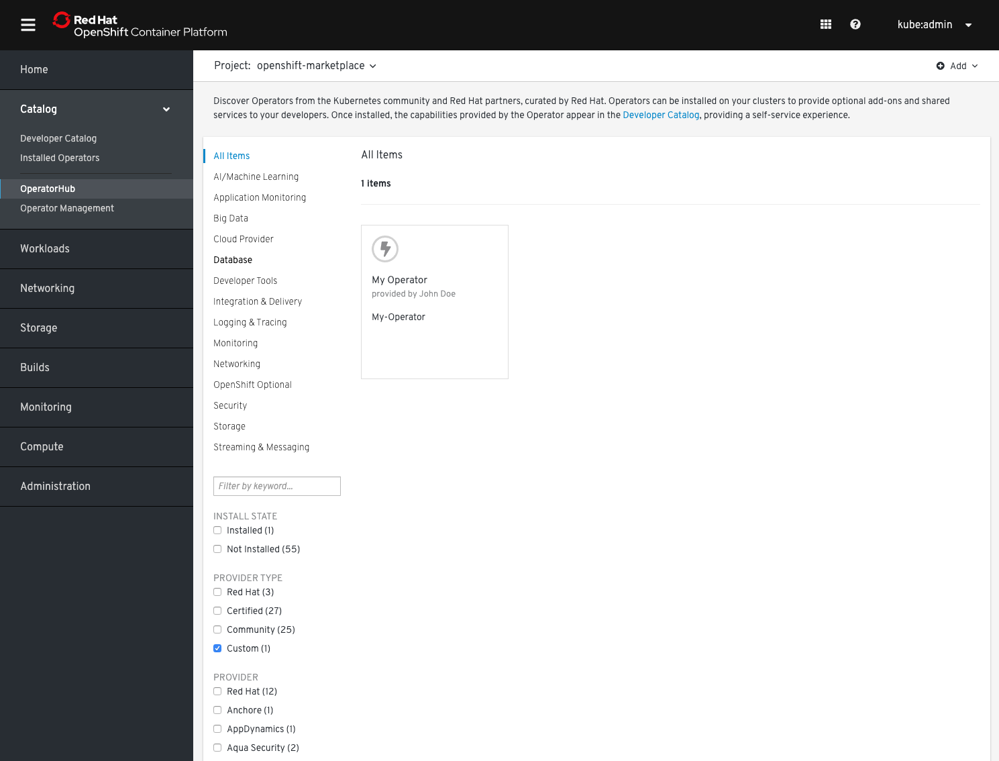
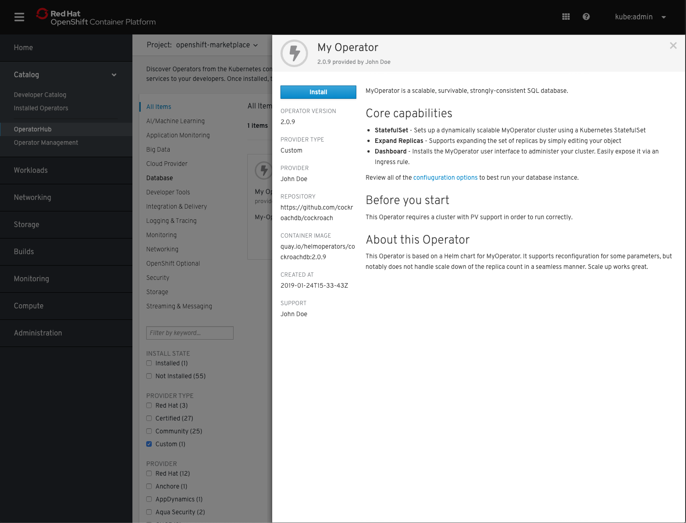
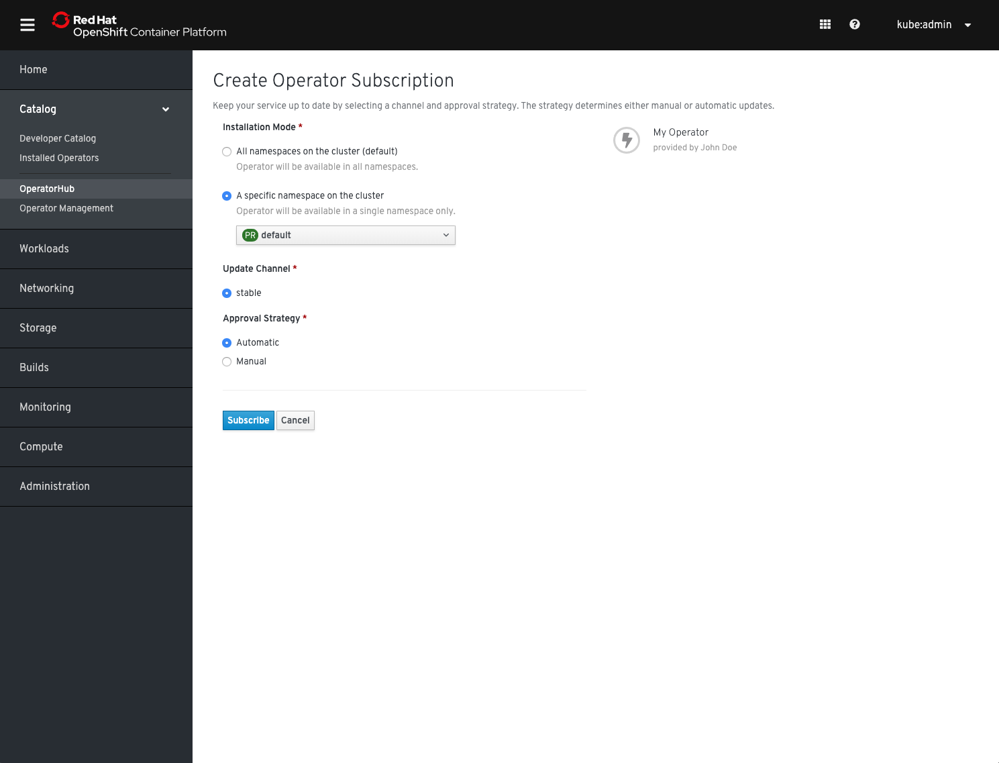
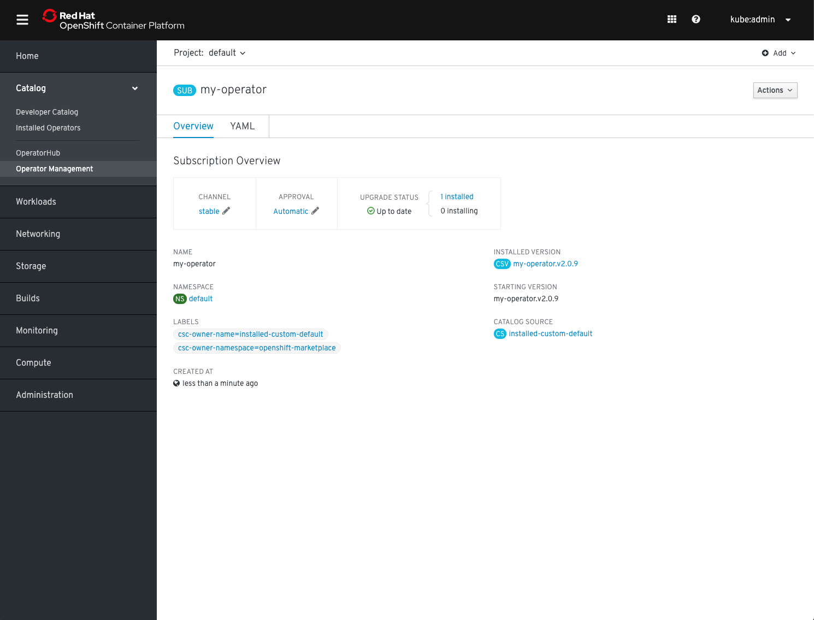
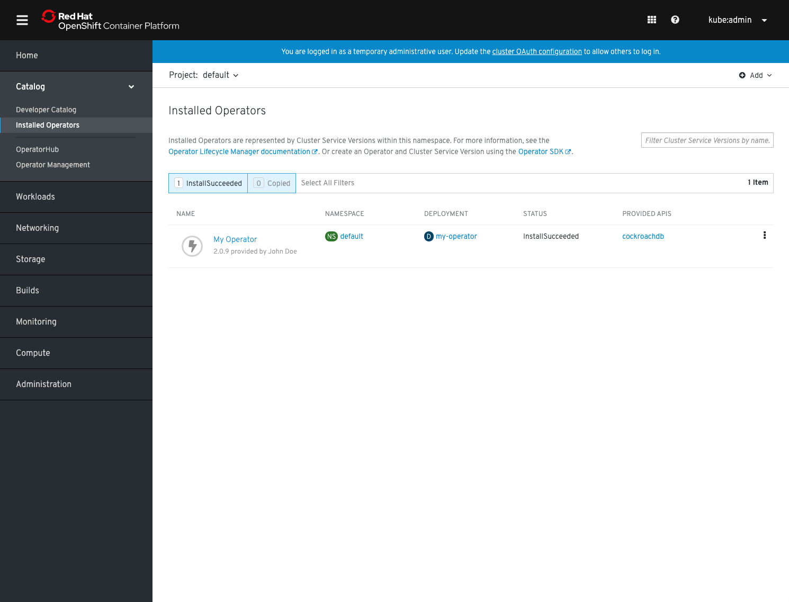

# Testing your Operator with Operator Framework
<!-- START doctoc generated TOC please keep comment here to allow auto update -->
<!-- DON'T EDIT THIS SECTION, INSTEAD RE-RUN doctoc TO UPDATE -->
<!-- **Table of Contents**  *generated with [DocToc](https://github.com/thlorenz/doctoc)*-->
- [Overview](#overview)
- [Pre-Requisites](#pre-requisites)
  - [Kubernetes cluster](#kubernetes-cluster)
  - [Repositories](#repositories)
  - [Tools](#tools)
    - [operator-courier](#operator-courier)
    - [Quay Login](#quay-login)
  - [Linting](#linting)
  - [Push to quay.io](#push-to-quayio)
- [Testing Operator Deployment on Kubernetes](#testing-operator-deployment-on-kubernetes)
  - [1. Get a Kubernetes cluster](#1-get-a-kubernetes-cluster)
  - [2. Install OLM](#2-install-olm)
  - [3. Install the Operator Marketplace](#3-install-the-operator-marketplace)
  - [4. Create the OperatorSource](#4-create-the-operatorsource)
  - [5. View Available Operators](#5-view-available-operators)
  - [6. Create an OperatorGroup](#6-create-an-operatorgroup)
  - [7. Create a Subscription](#7-create-a-subscription)
  - [8. Verify Operator health](#8-verify-operator-health)
- [Testing Operator Deployment on OpenShift](#testing-operator-deployment-on-openshift)
  - [1. Create the OperatorSource](#1-create-the-operatorsource)
  - [2. Find your Operator in the OperatorHub UI](#2-find-your-operator-in-the-operatorhub-ui)
  - [3. Install your Operator from OperatorHub](#3-install-your-operator-from-operatorhub)
  - [4. Verify Operator health](#4-verify-operator-health)
- [Testing with scorecard](#testing-with-scorecard)
- [Additional Resources](#additional-resources)
<!-- END doctoc generated TOC please keep comment here to allow auto update -->
## Overview
These instructions walk you through how to manually test if your Operator deploys correctly with Operator Framework. Although your submission will always be tested as part of the [CI](./ci.md) you can accelerate the process by testing locally.
These tests and all pre-requisite can also be executed automatically in a single step using a [Makefile](./using-scripts.md).
The process below assume that you have an Kubernetes Operator in the Operator Framework *manifest* format, where each version of your Operator bundle is nested it's own subdirectory:
```sh
$ tree my-operator/
my-operator
├── 0.1.0
│   ├── my-operator-crd1.crd.yaml
│   ├── my-operator-crd2.crd.yaml
│   └── my-operator.v0.1.0.clusterserviceversion.yaml
├── 0.5.0
│   ├── my-operator-crd1.crd.yaml
│   ├── my-operator-crd2.crd.yaml
│   ├── my-operator-crd3.crd.yaml
│   └── my-operator.v0.5.0.clusterserviceversion.yaml
├── 1.0.0
│   ├── my-operator-crd1.crd.yaml
│   ├── my-operator-crd2.crd.yaml
│   ├── my-operator-crd3.crd.yaml
│   └── my-operator.v1.0.0.clusterserviceversion.yaml
└── my-operator.package.yaml
```
where *my-operator* is the name of your Operator. If you don't have this format yet, refer to our [contribution documentation](./contributing.md). We will refer to this example of `my-operator` in the following instructions.
## Pre-Requisites
### Kubernetes cluster
For "upstream-community" operators targeting Kubernetes and [OperatorHub.io](https://operatorhub.io):
* A running Kubernetes cluster; [minikube](https://kubernetes.io/docs/setup/minikube/) is the simplest approach

For "community" operators targeting OCP/OKD and OperatorHub on OpenShift:
* either a running Kubernetes cluster; [minikube](https://kubernetes.io/docs/setup/minikube/) is the simplest approach
* or access to a running OpenShift 4 cluster, use [try.openshift.com](https://try.openshift.com/) to get a cluster on an AWS environment within ~30 mins
### Repositories
The following repositories are used throughout the process and should be cloned locally:
* [operator-marketplace](https://github.com/operator-framework/operator-marketplace)
* [operator-courier](https://github.com/operator-framework/operator-courier)
* [operator-lifecycle-manager](https://github.com/operator-framework/operator-lifecycle-manager)
For simplicity, the following commands will clone all of the repositories above:
```
git clone https://github.com/operator-framework/operator-marketplace.git
git clone https://github.com/operator-framework/operator-courier.git
git clone https://github.com/operator-framework/operator-lifecycle-manager.git
```
Before you begin your current working dir should look like the following, with `my-operator/` as an example for the name of your bundle:
```
my-operator-bundle/
operator-marketplace/
operator-courier/
operator-lifecycle-manager/
```
### Tools
#### operator-courier
`operator-courier` is used for metadata syntax checking and validation. This can be installed directly from `pip`:
```
pip3 install operator-courier
```
#### Quay Login
In order to test the Operator installation flow, store your Operator bundle on [quay.io](https://quay.io). You can easily create an account and use the free tier (public repositories only). To upload your Operator to quay.io a token is needed. This only needs to be done once and can be saved locally. The `operator-courier` repository has a script to retrieve the token:
```
./operator-courier/scripts/get-quay-token
Username: johndoe
Password:
{"token": "basic abcdefghijkl=="}
```
A token takes the following form and should be saved in an environment variable:
```
export QUAY_TOKEN="basic abcdefghijkl=="
```
> Note: Do not share your quay token.
### Linting
`operator-courier` will verify the fields included in the Operator metadata (CSV). The fields can also be manually reviewed according to [the operator CSV documentation](https://github.com/operator-framework/community-operators/blob/master/docs/required-fields.md).
The following command will run `operator-courier` against the bundle directory `my-operator-bundle/` from the example above.
**NOTE**: If you are using [Operator-SDK](https://github.com/operator-framework/operator-sdk) to generate the files the bundle directory `my-operator-bundle/` will be like `my-operator/deploy/olm-catalog/my-operator/`
```
$ operator-courier verify --ui_validate_io my-operator-bundle/
```
If there is no output, the bundle passed `operator-courier` validation. If there are errors, your bundle will not work. If there are warnings we still encourage you to fix them before proceeding to the next step.
### Push to quay.io
The Operator metadata in its bundle format will be uploaded into your namespace in [quay.io](http://quay.io). This bundle will be available in the `Application` tab and is generated by using the OLM files of your operator project. (E.g `https://quay.io/application/organization/$PACKAGE_NAME`)
**NOTE:** This command will NOT build the image of the operator project as it is done by `operator-sdk build` command.
Following the steps to build the bundle application and push it to the [quay.io](http://quay.io) registry.
1. Export the following local environment variables:

| EnvVar     | Description   | Example |
| --------   | -------- | -------- |
| OPERATOR_DIR   | Project path where the OLM files are | `my-operator-bundle/` |
| QUAY_NAMESPACE   | Registry namespace | `https://quay.io/my-registry-namespace` |
| PACKAGE_NAME   | The value for `PACKAGE_NAME` **must** be the same as in the operator's `*package.yaml` file and the operator bundle directory name. Assuming it is `my-operator`, this can be found by running `cat my-operator/olm-catalog/my-registry-namespace/my-operator`. | `https://quay.io/application/dev4devs-com/postgresql-operator-operatorhub` |
| PACKAGE_VERSION   | The `PACKAGE_VERSION` is entirely up for you to decide. The version is independent of the Operator version since your bundle will contain all versions of your Operator metadata files. If you already uploaded your bundle to Quay.io at an earlier point, make sure to increment the version.`. | `1.0.0` |
| TOKEN   | Quay.io token which will be used to create the application and sent the bundle| `"basic abcdefghijkl=="`  |

Following an example.
```
$export OPERATOR_DIR=my-operator-bundle/
$export QUAY_NAMESPACE=johndoe
$export PACKAGE_NAME=my-operator
$export PACKAGE_VERSION=1.0.0
$export TOKEN=$QUAY_TOKEN
```
2. Run the following command to push the bundle.
```
operator-courier push "$OPERATOR_DIR" "$QUAY_NAMESPACE" "$PACKAGE_NAME" "$PACKAGE_VERSION" "$TOKEN"
```
3. Check if the bundle was pushed successfully.
Once that has completed, you should see it listed in your account's [Applications](https://quay.io/application/) tab in the [quay.io](http://quay.io) registry. If the application has a lock icon, click through to the application and its Settings tab and select to make the application public.
Your Operator bundle is now ready for testing. To upload subsequent versions, bump semver string in the `PACKAGE_VERSION` variable, as `operator-marketplace` always downloads the newest bundle according to [semantic versioning](https://semver.org/).
## Testing Operator Deployment on Kubernetes
Please ensure you have fulfilled the [pre-requisites](#pre-requisites) before continuing with the instructions below.
### 1. Get a Kubernetes cluster
Start a Kubernetes `minikube` cluster:
```
minikube start
```
### 2. Install OLM
Install OLM into the cluster in the `olm` namespace:
```
kubectl apply -f https://github.com/operator-framework/operator-lifecycle-manager/releases/download/0.10.0/crds.yaml
kubectl apply -f https://github.com/operator-framework/operator-lifecycle-manager/releases/download/0.10.0/olm.yaml
```
### 3. Install the Operator Marketplace
Install Operator Marketplace into the cluster in the `marketplace` namespace:
```
kubectl apply -f operator-marketplace/deploy/upstream/
```
### 4. Create the OperatorSource
An `OperatorSource` object is used to define the external datastore we are using to store operator bundles. More information including example can be found in the documentation included in the `operator-marketplace` [repository](https://github.com/operator-framework/operator-marketplace#operatorsource).
**Replace** `johndoe` in `metadata.name` and `spec.registryNamespace` with your quay.io username in the example below and save it to a file called `operator-source.yaml`.
```
apiVersion: operators.coreos.com/v1
kind: OperatorSource
metadata:
  name: johndoe-operators
  namespace: marketplace
spec:
  type: appregistry
  endpoint: https://quay.io/cnr
  registryNamespace: johndoe
```
Now add the source to the cluster:
```
kubectl apply -f operator-source.yaml
```
The `operator-marketplace` controller should successfully process this object:
```
kubectl get operatorsource johndoe-operators -n marketplace
NAME                TYPE          ENDPOINT              REGISTRY   DISPLAYNAME  PUBLISHER   STATUS      MESSAGE                                       AGE
johndoe-operators   appregistry   https://quay.io/cnr   johndoe                 Succeeded   The object has been successfully reconciled   30s
```
Additionally, a `CatalogSource` is created in the `marketplace` namespace:
```
kubectl get catalogsource -n marketplace
NAME                           NAME        TYPE   PUBLISHER   AGE
johndoe-operators              Custom      grpc   Custom      3m32s
[...]
```
### 5. View Available Operators
Once the `OperatorSource` and `CatalogSource` are deployed, the following command can be used to list the available operators (until an operator is pushed into quay, this list will be empty):
> The command below assumes `johndoe-operators` as the name of the `OperatorSource` object. Adjust accordingly.
```
kubectl get opsrc johndoe-operators -o=custom-columns=NAME:.metadata.name,PACKAGES:.status.packages -n marketplace
NAME                PACKAGES
johndoe-operators   my-operator
```
### 6. Create an OperatorGroup
An `OperatorGroup` is used to denote which namespaces your Operator should be watching. It must exist in the namespace where your operator should be deployed, we'll use `marketplace` in this example.
Its configuration depends on whether your Operator supports watching its own namespace, a single namespace or all namespaces (as indicated by `spec.installModes` in the CSV).
Create the following file as  `operator-group.yaml` if your Operator supports watching its own or a single namespace.
If your Operator supports watching all namespaces you can leave the property `spec.targetNamespace` present but empty. This will create an `OperatorGroup` that instructs the Operator to watch all namespaces.
```
apiVersion: operators.coreos.com/v1alpha2
kind: OperatorGroup
metadata:
  name: my-operatorgroup
  namespace: marketplace
spec:
  targetNamespaces:
  - marketplace
```
Deploy the `OperatorGroup` resource:
```
kubectl apply -f operator-group.yaml
```
### 7. Create a Subscription
The last piece ties together all of the previous steps. A `Subscription` is created to the operator. Save the following to a file named: `operator-subscription.yaml`:
```
apiVersion: operators.coreos.com/v1alpha1
kind: Subscription
metadata:
  name: my-operator-subsription
  namespace: marketplace
spec:
  channel: <channel-name>
  name: my-operator
  source: johndoe-operators
  sourceNamespace: marketplace
```
If your Operator supports watching all namespaces, change the namespace of the Subscription from `marketplace` to `operators`. In any case replace `<channel-name>` with the contents of `channel.name` in your `package.yaml` file.
Then create the `Subscription`:
```
kubectl apply -f operator-subscription.yaml
```
### 8. Verify Operator health
Watch your Operator being deployed by OLM from the catalog source created by Operator Marketplace with the following command:
```
kubectl get clusterserviceversion -n marketplace
NAME                 DISPLAY       VERSION   REPLACES   PHASE
my-operator.v1.0.0   My Operator   1.0.0                Succeeded
```
> The above command assumes you have created the `Subscription` in the `marketplace` namespace.
If your Operator deployment (CSV) shows a `Succeeded` in the `InstallPhase` status, your Operator is deployed successfully. If that's not the case check the `ClusterServiceVersion` objects status for details.
Optional also check your Operator's deployment:
```
kubectl get deployment -n marketplace
```
## Testing Operator Deployment on OpenShift
On OpenShift Container Platform and OKD 4.1 or newer `operator-marketplace` and `operator-lifeycle-manager` are already installed. You can start right away by creating an `OperatorSource` in the `openshift-marketplace` namespace as a user with the `cluster-admin` role. You will then use the UI to install your Operator. If you are interested what happens in the background, go through the [Testing on Kubernetes](#testing-operator-deployment-on-kubernetes) section above.
### 1. Create the OperatorSource
An `OperatorSource` object is used to define the external datastore we are using to store operator bundles. More information including example can be found in the documentation included in the `operator-marketplace` [repository](https://github.com/operator-framework/operator-marketplace#operatorsource).
**Replace** `johndoe` in `metadata.name` and `spec.registryNamespace` with your quay.io username in the example below and save it to a file called `operator-source.yaml`.
```
apiVersion: operators.coreos.com/v1
kind: OperatorSource
metadata:
  name: johndoe-operators
  namespace: openshift-marketplace
spec:
  type: appregistry
  endpoint: https://quay.io/cnr
  registryNamespace: johndoe
  displayName: "John Doe's Operators"
  publisher: "John Doe"
```
Create the object:
```
oc apply -f operator-source.yaml
```
Check if the `OperatorSource` was processed correctly:
```
oc get operatorsource johndoe-operators -n openshift-marketplace
NAME                TYPE          ENDPOINT              REGISTRY   DISPLAYNAME            PUBLISHER   STATUS      MESSAGE                                       AGE
johndoe-operators   appregistry   https://quay.io/cnr   johndoe    John Doe's Operators   John Doe    Succeeded   The object has been successfully reconciled   30s
```
### 2. Find your Operator in the OperatorHub UI
Go to your OpenShift UI and find your Operator by filtering for the *Custom* category:

### 3. Install your Operator from OperatorHub
To install your Operator simply click its icon and in the proceeding dialog click *Install*.

 You will be asked where to install your Operator. Select either of the desired installation modes, if your Operator supports it and then click *Subscribe*

You will be forwarded to the *Subscription Management* section of the OLM UI and after a couple of moments your Operator will be transitioning to *Installed*.

### 4. Verify Operator health
Change to the *Installed Operators* section in the left-hand navigation menu to verify your Operator's installation status:

It should have transitioned into the state *InstallationSucceeded*. You can now test it by starting to use its APIs.
## Testing with scorecard
If your Operator is up and running you can verify it is working as intended using its APIs. Additionally you can run [operator-sdk](https://github.com/operator-framework/operator-sdk/blob/master/doc/test-framework/scorecard.md)'s `scorecard` utility for validating against good practice and correctness of your Operator.
Assuming you are still in your top-level directory where `my-operator/` is your bundle location and an environment variable called `KUBECONFIG` points to a running `minikube` or OpenShift cluster with OLM present:
```
operator-sdk scorecard --olm-deployed --crds-dir my-operator/ --csv-path my-operator/my-operator.v1.0.0.clusterserviceversion.yaml
```
## Additional Resources
* [Cluster Service Version Spec](https://github.com/operator-framework/operator-lifecycle-manager/blob/master/doc/design/building-your-csv.md)
* [Example Bundle](https://github.com/operator-framework/community-operators/tree/master/upstream-community-operators/etcd)
